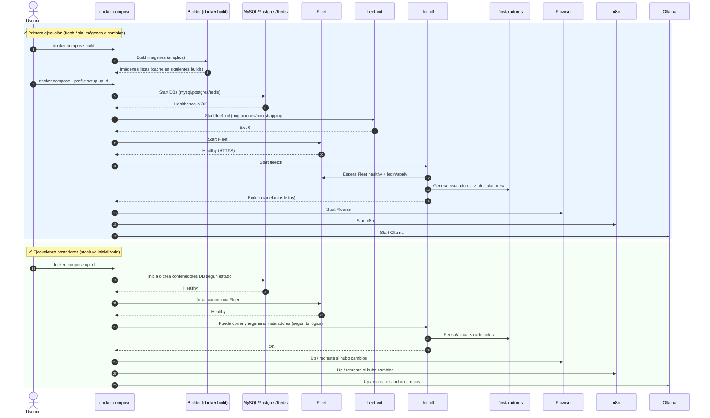

# Diagrama de secuencia de inicialización de contenedores

```mermaid
sequenceDiagram
autonumber
actor U as Usuario
participant DC as docker compose
participant BI as Builder (docker build)
participant DB as MySQL/Postgres/Redis
participant FL as Fleet
participant FI as fleet-init
participant FC as fleetctl
participant INST as ./instaladores
participant FW as Flowise
participant N8N as n8n
participant OL as Ollama

rect rgb(235,245,255)
note over U,DC: ✅ Primera ejecución (fresh / sin imágenes o cambios)
U->>DC: docker compose build
DC->>BI: Build imágenes (si aplica)
BI-->>DC: Imágenes listas (cache en siguientes builds)

U->>DC: docker compose --profile setup up -d

DC->>DB: Start DBs (mysql/postgres/redis)
DB-->>DC: Healthchecks OK

DC->>FI: Start fleet-init (migraciones/bootstrapping)
FI-->>DC: Exit 0

DC->>FL: Start Fleet
FL-->>DC: Healthy (HTTPS)

DC->>FC: Start fleetctl
FC->>FL: Espera Fleet healthy + login/apply
FC->>INST: Genera instaladores -> ./instaladores/
FC-->>DC: Exitoso (artefactos listos)

DC->>FW: Start Flowise
DC->>N8N: Start n8n
DC->>OL: Start Ollama
end

rect rgb(245,255,245)
note over U,DC: ✅ Ejecuciones posteriores (stack ya inicializado)
U->>DC: docker compose up -d

DC->>DB: Inicia o crea contenedores DB segun estado
DB-->>DC: Healthy

DC->>FL: Arranca/continúa Fleet
FL-->>DC: Healthy

DC->>FC: Puede correr y regenerar instaladores (según tu lógica)
FC->>INST: Reusa/actualiza artefactos
FC-->>DC: OK

DC->>FW: Up / recreate si hubo cambios
DC->>N8N: Up / recreate si hubo cambios
DC->>OL: Up / recreate si hubo cambios
end
```
