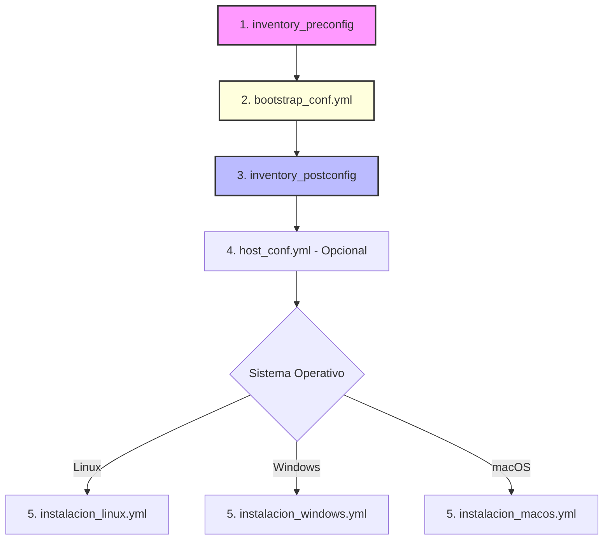

# Documentación del Flujo Operativo de Automatización con Ansible

## Índice

1. [Introducción](#1-introducción)
2. [Diagrama de Flujo del Ciclo de Vida](#2-diagrama-de-flujo-del-ciclo-de-vida)
3. [Fases del Proceso](#3-fases-del-proceso)
    - [3.1 Prerrequisitos de la Plataforma](#31-prerrequisitos-de-la-plataforma)
    - [3.2 Fase de Preconfiguración](#32-fase-de-preconfiguración-inventory_preconfig)
    - [3.3 Normalización de Acceso](#33-normalización-de-acceso-bootstrap_confyml)
    - [3.4 Fase Operativa](#34-fase-operativa-inventory_postconfig)
    - [3.5 Personalización del Host](#35-personalización-del-host-host_confyml)
    - [3.6 Despliegue de Aplicaciones](#36-despliegue-de-aplicaciones-instalacion_xxxyml)
4. [Consideraciones de Seguridad y Cumplimiento](#4-consideraciones-de-seguridad-y-cumplimiento)
5. [**`Guía de Inicio Rápido (Quick Start)`**](#5-guía-de-inicio-rápido-quick-start)

---

## 1. Introducción

El presente documento describe el flujo estandarizado para la gestión del ciclo de vida de los hosts dentro de la infraestructura automatizada mediante Ansible. Este modelo garantiza una transición segura desde el estado inicial hasta un estado operativo normalizado, segregando las responsabilidades de acceso según el sistema operativo.

---

## 2. Diagrama de Flujo del Ciclo de Vida

## 3. Fases del Proceso

### 3.1 Prerrequisitos de la Plataforma

Antes de iniciar el flujo operativo, es imperativo cumplir con los siguientes requisitos de entorno y seguridad:

#### 3.1.1 Configuración de Secretos (Ansible Vault)

El modelo de seguridad se basa en la segregación de credenciales sensibles. Es obligatorio inicializar un archivo `vault.yml` que contenga, como mínimo, las siguientes variables normalizadas:

- `vault_ansible_user`: Nombre del usuario administrador/estándar a crear.
- `vault_ansible_user_password`: Contraseña cifrada para dicho usuario.

> **Nota:** El archivo debe cifrarse mediante `ansible-vault encrypt group_vars/all/vault.yml` y la clave de cifrado debe estar disponible en el entorno de ejecución.

#### 3.1.2 Dependencias del Nodo de Control

Para la gestión de nodos Windows, el nodo de control (donde reside Ansible) debe tener instalada la librería de Python necesaria para la comunicación vía WinRM:

- **Librería:** `pywinrm`

### 3.2 Fase de Preconfiguración (inventory_preconfig)

Estado inicial de los activos para el aprovisionamiento básico y primera conexión de gestión.

- **Estado del Host:**
  - **Unix-like:** Servicio SSH habilitado (autenticación inicial por contraseña).
  - **Windows:** Protocolo WinRM activo (credenciales de bootstrap predefinidas).

#### Comparativa Técnica de Acceso

| Característica | SSH (Linux / macOS) | WinRM (Windows) |
| :--- | :--- | :--- |
| **Capa de Transporte** | TCP 22 | HTTP(S) 5985/5986 |
| **Autenticación** | Password / Key | NTLM / Kerberos / Basic |
| **Escala de Privilegios** | sudo / su | Administrador Local |

### 3.3 Normalización de Acceso (bootstrap_conf.yml)

Fase crítica de transición de credenciales de *bootstrap* a identidades corporativas gestionadas y normalizadas.

- **Para Linux y macOS:**
  - Creación de usuario estándar y configuración de privilegios en `sudoers`.
  - Inyección de llaves públicas SSH (**PKI**).
  - **Hardening:** Deshabilitación de *root login* y autenticación por contraseña.
- **Para Windows:**
  - Creación de usuario administrador normalizado mediante el módulo `win_user`.
  - Aseguramiento de permisos de membresía en grupos para persistencia vía WinRM.
- **Resultado:** El inventario `preconfig` queda deprecado y fuera de uso.

### 3.4 Fase Operativa (inventory_postconfig)

El host se integra en el inventario definitivo bajo un esquema de gestión profesional y seguro.

- **Seguridad:** Integración mandatoria con **Ansible Vault** para la gestión de secretos.
- **Acceso:** Autenticación exclusiva mediante llaves SSH (Unix) o identidades administradoras securizadas (Windows).
- **Estado:** Nodo en estado operativo estable, auditable y preparado para la configuración de servicios.

### 3.5 Personalización del Host (host_conf.yml)

Aplicación de ajustes específicos por nodo (fase opcional según el rol del host).

- **Red e Identidad:** Configuración de *Hostname*, resolución DNS y direccionamiento IP estático.
- **Base:** Instalación de herramientas de diagnóstico, endurecimiento de firewalls locales (firewalld/NSG) y despliegue de agentes de monitoreo.

### 3.6 Despliegue de Aplicaciones (instalacion_XXX.yml)

Esta fase final ejecuta el despliegue de paquetes específicos (en este caso, el agente Fleet/Osquery) utilizando playbooks segmentados por grupos de inventario. El flujo se basa en la transferencia de binarios desde el controlador Ansible hacia una ruta temporal en el nodo de destino para su posterior instalación nativa.

- **Estrategia de Ejecución:** Segmentación por grupos de hosts (`linux`, `windows`, `macos`).
- **Origen de Datos:** Directorio local `../instaladores/`.

#### Detalle por Sistema Operativo

| Playbook | Objetivo | Método de Instalación |
| :--- | :--- | :--- |
| `instalacion_windows.yml` | **Windows** | Transferencia a `C:\Temp` y uso de `win_package` para archivos **MSI**. |
| `instalacion_macos.yml` | **macOS** | Transferencia a `/tmp/` y ejecución vía `installer -pkg` con privilegios de superusuario. |
| `instalacion_linux.yml` | **Linux** | Detección interna de familia (`Debian` vs `RedHat`) para instalar **DEB** (via apt) o **RPM** (via dnf). |

#### Flujo Técnico Común

1. **Preparación:** Creación de un directorio temporal seguro en el host remoto.
2. **Transferencia:** Copia del artefacto correspondiente desde el repositorio central de instaladores.
3. **Despliegue Silencioso:**
    - **Windows:** Parámetros `/qn /norestart` para evitar interacción de usuario.
    - **macOS:** Target definido en `/` para instalación a nivel de sistema.
    - **Linux:** Instalación directa de binarios locales con resolución de dependencias y omisión de verificación GPG si es requerido.

---

## 4. Consideraciones de Seguridad y Cumplimiento

- **Segregación:** El usuario de *bootstrap* posee un ciclo de vida limitado estrictamente a las Fases 1 y 2.
- **Trazabilidad:** A partir de la Fase 3, toda acción operativa se vincula a identidades centralizadas y gestionadas en Vault.
- **Persistencia:** La política de acceso y cumplimiento de seguridad se centraliza exclusivamente en el playbook `bootstrap_conf.yml`.

---

## 5. Guía de Inicio Rápido (Quick Start)

Para iniciar el flujo operativo, siga estrictamente este orden de preparación:

1. **Paso 1: Configurar Vault** Crear el archivo `group_vars/all/vault.yml` con las variables `vault_ansible_user` y `vault_ansible_user_password`. Cifrarlo con:  
    `ansible-vault encrypt group_vars/all/vault.yml`

2. **Paso 2: Instalar Dependencias** En el nodo de control, instalar la librería necesaria para gestionar los nodos Windows:  
    `pywinrm`

3. **Paso 3: Validar Inventario Inicial** Asegurar que los hosts en `inventory_preconfig` responden vía SSH (Unix) o WinRM (Windows) con las credenciales temporales de *bootstrap*.

4. **Paso 4: Ejecutar Normalización** Lanzar el playbook de identidad:  
    `ansible-playbook -i inventory_preconfig bootstrap_conf.yml --ask-vault-pass`

5. **Paso 5: Despliegue Operativo** Una vez normalizado el acceso, utilizar `inventory_postconfig` para las fases de configuración y despliegue de aplicaciones.

---
